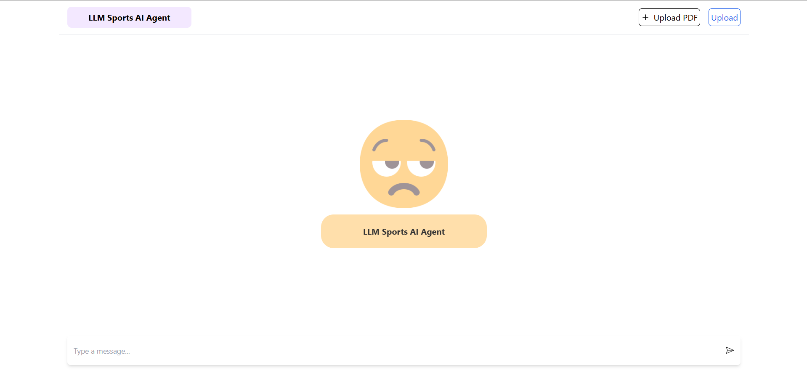
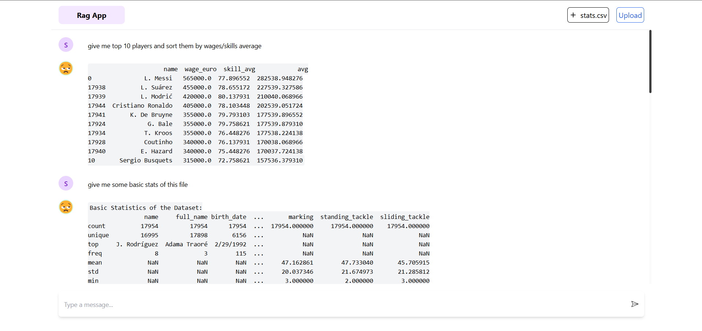
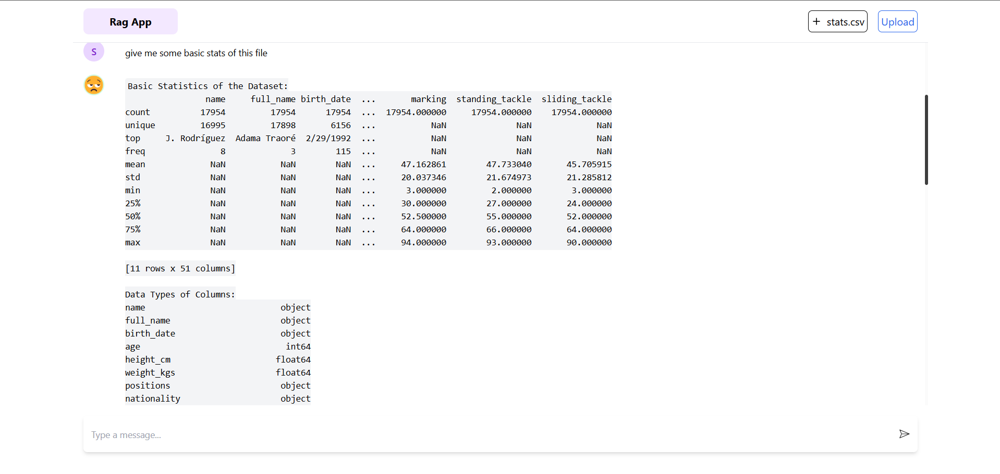

# LLM-Based Sports AI Agent

## Overview  
The **LLM-Based Sports AI Agent** is a cutting-edge platform designed to empower users with AI-driven insights into sports data. Leveraging advanced Large Language Models (LLMs), this system enables users to analyze sports statistics or player performance data from CSV or Excel sheets through natural language queries.

---

## Problem Statement  
The project addresses the need for an intuitive and intelligent system to analyze sports data. It allows users to:  
- Upload CSV or Excel sheets containing sports statistics or player performance data.  
- Query the dataset in plain English for actionable insights.  
- Get immediate responses powered by an LLM.

---

## Features  
- **Natural Language Querying**: Ask questions about the uploaded sports data using natural language.  
- **Dynamic Insights**: Receive code execution results or summaries for your queries in real time.  
- **WebSocket Integration**: Live communication for instant processing and feedback.  
- **Data Compatibility**: Supports CSV and Excel files for flexibility.  
- **Code Suggestions**: Automatically generate code to perform advanced queries.  
- **Schema Extraction**: Automatically extracts and displays dataset schema for reference.  

---

## Tech Stack  
### Frontend  
- **React**: Interactive UI for querying and data visualization.  
- **WebSocket**: Real-time communication between client and server.  

### Backend  
- **FastAPI**: Robust backend framework for managing WebSocket connections and LLM integration.  
- **Python**: Core language for data manipulation and LLM operations.  
- **Pandas**: Data analysis and processing.  
- **Gemini**: LLM integration for intelligent query handling.  

---

## Installation  

### Backend Setup  
1. Navigate to the `app` directory:  
   ```bash
   cd app
   ```  
2. Install the required Python dependencies:  
   ```bash
   pip install -r requirements.txt
   ```  
3. Configure the Google API Key:  
   - Provide the `GOOGLE_API_KEY` in the `.env` file located in the `app` directory.  
   - Use the `.envSample` file as a reference:  
     ```bash
     cp .envSample .env
     ```
     Edit the `.env` file to include your Google API key:  
     ```env
     GOOGLE_API_KEY=your-google-api-key
     ```
4. Run the FastAPI server:  
   ```bash
   python main.py
   ```  

### Frontend Setup  
1. Navigate to the `client` directory:  
   ```bash
   cd client
   ```  
2. Install the required packages:  
   ```bash
   npm install
   ```  
3. Start the development server:  
   ```bash
   npm run dev
   ```  

---

## Usage  

1. **Upload Data**: Upload a CSV or Excel file containing sports statistics or player performance data via the frontend.  
2. **Ask Questions**: Use the natural language input to query the data (e.g., "Which player has the highest average score?").  
3. **Receive Insights**: View the query results dynamically generated by the AI agent.  

---

## Screenshots  
  
  
  

---

## Example Queries  
- "Show me the top 5 players with the highest batting average."  
- "Which teams scored the most points in 2023?"  
- "List all players with more than 20 assists in a game."  

---

## Demo Video  
[Watch Demo Video](https://drive.google.com/file/d/1RIJTy7TB9raU03r7z4zZ9Zfr2TOG9-SM/view?usp=sharing)  