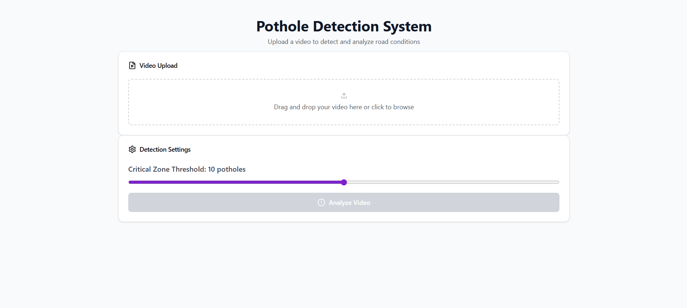
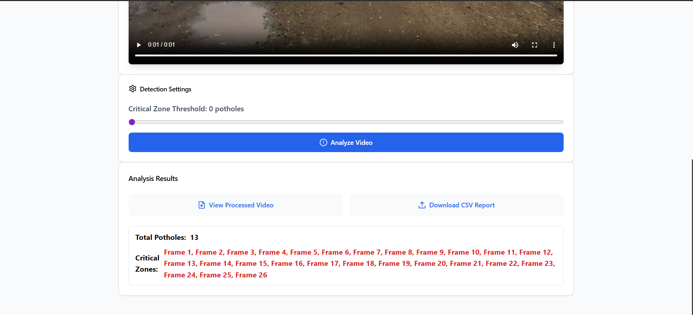

# Pothole Detection System

A robust **Pothole Detection System** leveraging modern technologies to analyze and process video footage to identify potholes and generate insights. This system is designed for municipalities and organizations aiming to improve road safety and maintenance efficiency.

---

## Features

- **Video Upload and Processing**: Upload video footage and detect potholes efficiently.
- **Dynamic Threshold Setting**: Adjust the threshold to define critical zones based on the number of potholes.
- **CSV Report Generation**: Download detailed CSV reports with pothole data.
- **Summarization**: View summarized results, including total potholes and critical zones.
- **Interactive UI**: A user-friendly interface for video playback and results display.

---

## Tech Stack

### Backend
- **Python**
- **FastAPI** (with Uvicorn): For creating the backend server.
- **OpenCV**: For video frame processing.
- **Google Drive API**: For file uploads and sharing.

### Frontend
- **React** (with Vite for fast development).
- **Tailwind CSS**: For responsive and elegant UI design.

### Other Tools
- **Node.js**: For frontend dependency management and development.
- **Git**: For version control.

---

## Installation and Setup

### Backend (Server)
1. Navigate to the `app` directory:
   ```bash
   cd app
   ```
2. Install the required Python packages:
   ```bash
   pip install -r requirements.txt
   ```
3. Download the trained model (`best.pt`) from this <a href='https://drive.google.com/file/d/1TWHnNlx7Ys2UsOFGGrBOkr4NFwIsNITH/view?usp=drive_link'>link</a>, which is necessary for the pothole detection, and move it to the `app/models` directory.

4. Run the backend server:
   ```bash
   python main.py
   ```

### Frontend (Client)
1. Navigate to the `client` directory:
   ```bash
   cd client
   ```
2. Install the dependencies:
   ```bash
   npm install
   ```
3. Start the development server:
   ```bash
   npm run dev
   ```

---

## Usage
1. **Upload Video**: Use the frontend UI to upload a video file.
2. **Set Threshold**: Adjust the threshold slider for critical zone detection.
3. **Process Video**: Click "Process Video" to analyze the uploaded video.
4. **View Results**: Download the processed video and CSV report. Summarized data will be displayed on the screen.

---

## Directory Structure

```
pothole-detection-system/
├── app/                 # Backend server and processing logic
│   ├── main.py          # Entry point for the backend
│   ├── requirements.txt # Python dependencies
│   ├── models/          # Folder to store models
│   │   └── best.pt      # Trained model for pothole detection
│   └── ...              # Additional backend files
├── client/              # Frontend application
│   ├── src/             # React application source
│   ├── vite.config.js   # Vite configuration
│   └── package.json     # Node.js dependencies
├── README.md            # Project documentation
└── ...                  # Other project files
```

---

## License
This project is licensed under the MIT License.

---

## Screenshots


